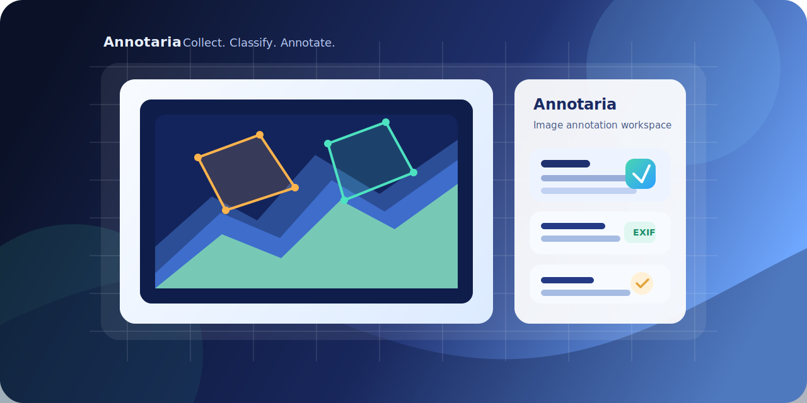

# Annotaria

<p align="center">
  
</p>

<p align="center"><strong>Annotaria</strong> e una piattaforma web per raccogliere, organizzare e annotare immagini con questionari strutturati, metadati EXIF e annotazioni poligonali.</p>

<p align="center">
  <a href="./docs/Setup.md">Setup</a> ·
  <a href="./docs/Manuale_Utente.md">Manuale Utente</a> ·
  <a href="./docs/API_REST.md">API REST</a> ·
  <a href="./docs/Database_Structure.md">Database</a> ·
  <a href="./docs/API_Examples.md">Esempi API</a>
</p>

<p align="center">
  
  
  
  
</p>

Annotaria e pensata per team che devono trasformare immagini grezze in dataset coerenti e riusabili. Il flusso combina catalogazione delle immagini, assegnazione per competenze, compilazione di questionari guidati e salvataggio delle annotazioni in un database relazionale.

## Highlights

- Supporto a immagini `.jpg`, `.jpeg`, `.tif`, `.tiff`, `.png`, `.raw`, `.nef`, `.cr2`, `.arw`
- Estrazione automatica dei metadati EXIF, inclusi camera, timestamp e coordinate GPS quando disponibili
- Annotazioni grafiche su canvas con poligoni associati a etichette
- Questionari a risposta multipla con logiche di follow-up
- Controllo accessi con autenticazione JWT e ruoli `Amministratore` / `Esperto`
- Filtri di visibilita basati sulle competenze degli esperti
- Interfaccia web integrata e API REST documentate da FastAPI
- Supporto a `SQLite` e `PostgreSQL`

## Come Funziona

1. L'amministratore importa o carica le immagini e assegna la tipologia corretta.
2. Gli esperti selezionano le proprie competenze e visualizzano solo le immagini rilevanti.
3. Ogni immagine puo essere valutata tramite questionario e annotazioni poligonali.
4. Risposte, label e geometrie vengono salvate in database per analisi, revisione o training pipeline successive.

## Stack

- Backend: `FastAPI`, `SQLAlchemy`, `Pydantic`
- Auth: `OAuth2 password flow` con token `JWT`
- Frontend: template server-side + `JavaScript` su canvas
- Imaging: `Pillow` per lettura immagini e metadati
- Database: `SQLite` di default, `PostgreSQL` supportato
- Deploy: esecuzione diretta con `uvicorn` oppure container `Docker`

## Quick Start

### Docker

```bash
docker compose build --no-cache
docker compose up -d
```

### Ambiente virtuale

```bash
python -m venv venv
venv\Scripts\activate
pip install -r requirements.txt
uvicorn main:app --host 0.0.0.0 --port 9100
```

Su Linux/macOS l'attivazione dell'ambiente diventa:

```bash
source venv/bin/activate
```

## Accesso Locale

- UI: `http://localhost:9100/ui`
- Docs API: `http://localhost:9100/docs`
- Redirect root: `http://localhost:9100/` porta automaticamente alla UI

Credenziali iniziali:

- `admin` / `admin` come utente amministratore disponibile al primo avvio

## Funzionalita Principali

### Gestione immagini

- upload singolo da interfaccia
- import massivo da sottocartelle di `IMAGE_DIR`
- sincronizzazione dei file con il database
- memorizzazione dei metadati EXIF

### Annotazione e revisione

- disegno di poligoni direttamente sull'immagine
- associazione delle annotazioni a label gestite a catalogo
- consultazione e modifica centralizzata di risposte e annotazioni

### Organizzazione del lavoro

- tipologie immagine
- tipologie esperto
- assegnazione automatica delle immagini in base alle competenze
- questionari con domande dipendenti dalle risposte precedenti

## Struttura Del Progetto

```text
annotaria/
|-- main.py
|-- database.py
|-- models.py
|-- routers/
|-- schemas/
|-- templates/
|-- static/
|-- image_data/
|-- docs/
`-- .env
```

## Documentazione

- [Setup e configurazione](./docs/Setup.md)
- [Manuale utente](./docs/Manuale_Utente.md)
- [API REST](./docs/API_REST.md)
- [Esempi API](./docs/API_Examples.md)
- [Struttura database](./docs/Database_Structure.md)

## Licenza

Distribuito come progetto open source sotto licenza MIT.
